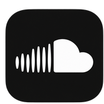
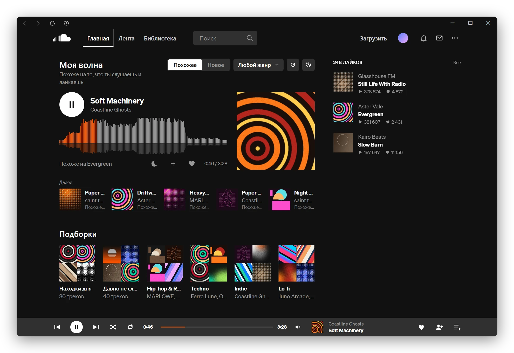
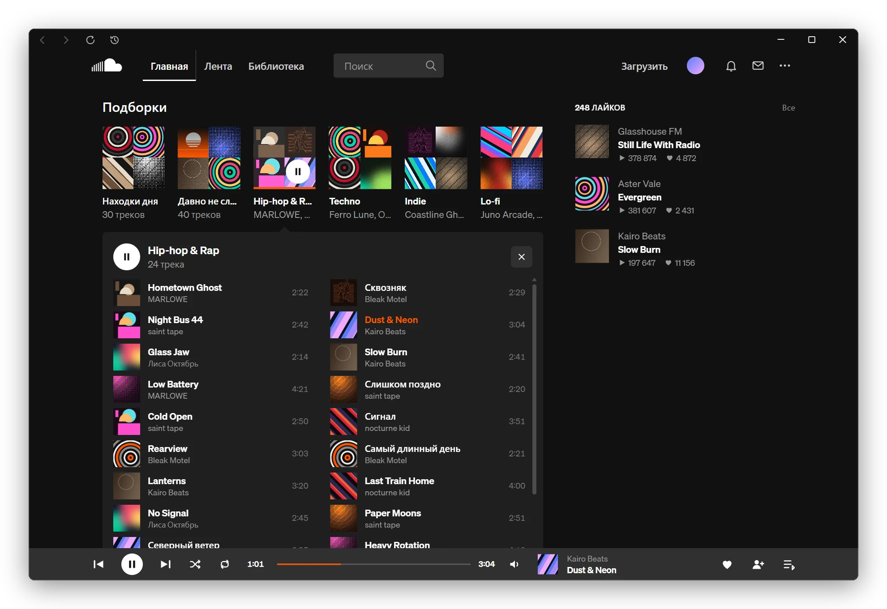
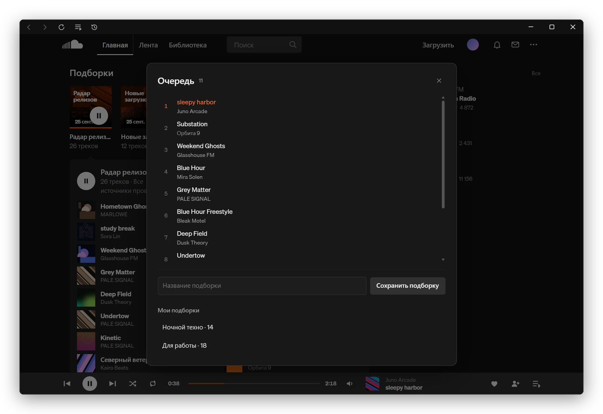
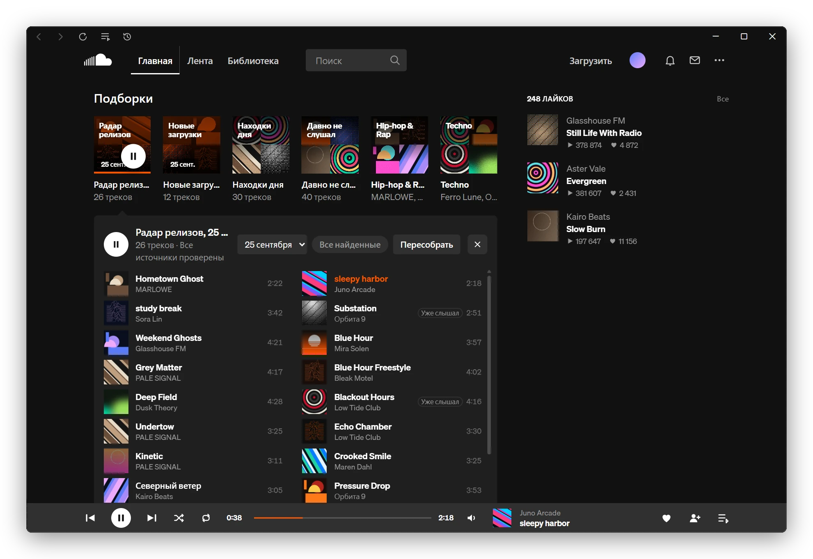
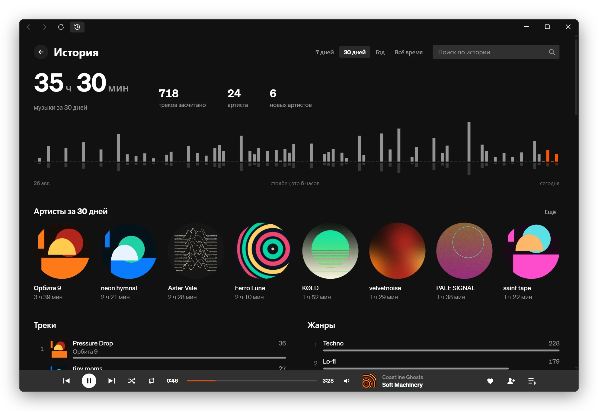
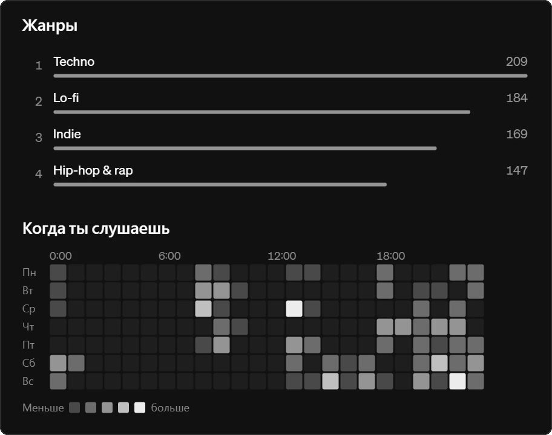
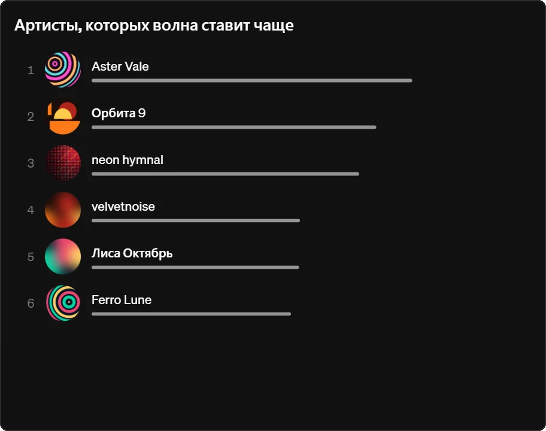
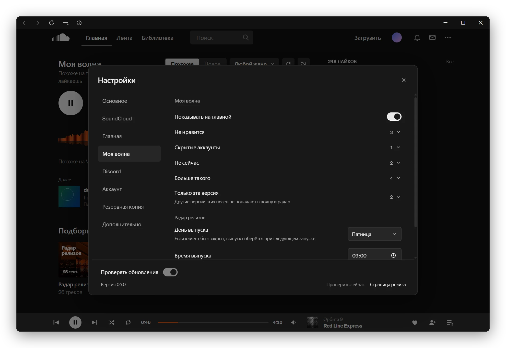
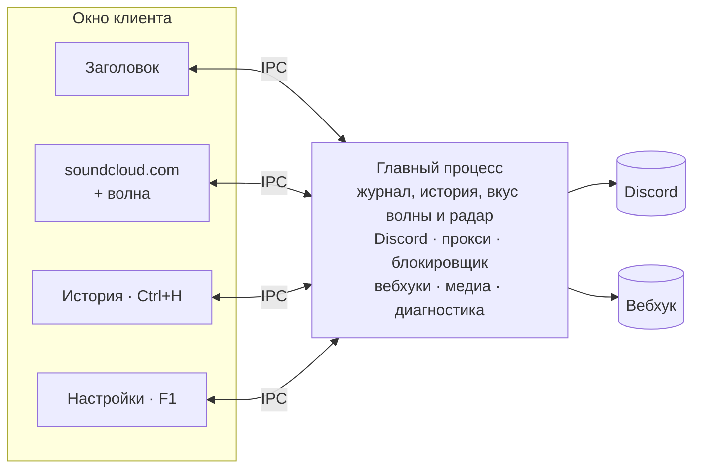

<div align="center">



<h1>SoundCloud Desktop</h1>

<p>Клиент SoundCloud для Windows со своей волной рекомендаций и историей прослушиваний.</p>

<a href="https://github.com/zxczxczxczxczxczxc1111/soundcloud-desktop/releases/latest"></a>

<sub>Версия 0.8.0 для Windows 10 и 11 x64</sub>

<a href="#моя-волна">Моя волна</a>&emsp;<a href="#радар-релизов">Радар релизов</a>&emsp;<a href="#история">История</a>&emsp;<a href="#что-ещё-есть-в-клиенте">Что ещё есть</a>&emsp;<a href="#установка">Установка</a>

</div>

<br>



Это soundcloud.com в своём окне, только главная другая: вместо полок сайта твоя волна, подборки на день и пятничный радар релизов. Клиент ведёт журнал того, что ты слушаешь, по нему подбирает треки и показывает историю. Журнал лежит только у тебя на компьютере.

## Моя волна

Жмёшь play, и клиент собирает бесконечную очередь из похожего на то, что ты слушаешь и лайкаешь. Пока трек играет, очередь догружается, один артист не идёт подряд, а под треком подписано, почему он в волне. Что ещё умеет волна:

- **Похожее или новое**: «Похожее» подбирает треки вокруг твоих лайков и истории, «Новое» берёт треки в твоём вкусе, которых ты ещё не слышал. Жанры можно задать своими словами: `techno, dark techno`.
- **Вкус по тому, как ты слушаешь**: дослушанный трек, пропуск в первые 30 секунд и лайк меняют то, что волна поставит дальше. Свою картину твоего вкуса волна показывает на странице истории.
- **«Больше такого» и «Не сейчас»**: кнопки у играющего трека. Первая добавляет в волну похожее, вторая убирает трек из волны на неделю. Из меню по правой кнопке так же убирается артист, а «Не нравится» и «Не показывать артиста» убирают насовсем.
- **Волна от чего угодно**: нажми правой кнопкой на трек, артиста или плейлист на сайте, и волна начнётся от него. Когда похожее кончится, продолжит станция трека.
- **«Встряхнуть»**: меняет треки впереди, играющий не прерывается.
- **Версии трека**: волна различает оригинал, slowed, sped up, ремиксы и лайвы, а перезалив той же версии второй раз не ставит. «Версии этого трека» в меню покажет остальные, «Скрыть другие версии» уберёт их из волны и радара.

### Подборки на каждый день

Под волной каждый день новая полка:

- **Радар релизов и новые загрузки**: первыми на полке, подробнее [ниже](#радар-релизов).
- **Находки дня**: треки, которых ты ещё не слышал, из похожих на любимое. Список меняется в полночь.
- **Давно не слушал**: твои лайки, которые давно не звучали.
- **Твои вкусы**: клиент делит твои лайки по жанрам и тегам, до девяти групп, и у каждой своя волна.
- **Своя подборка**: выбери до пяти треков пунктом «Добавить в подборку» в меню, и волна пойдёт от них.

Нажми на карточку, и под полкой раскроется её список. Любой трек из него можно включить первым, а за ним пойдёт остальная подборка.



Полки сайта на главной скрыты, волна их заменяет. Вернуть любую можно в настройках: <kbd>F1</kbd> → Главная.

Треки Go+, которые без подписки играют 30 секунд, и миксы длиннее 15 минут в волну не попадают.

### Очередь и продолжение прослушивания

Кнопка очереди в шапке открывает список треков. В меню трека можно поставить его следующим или добавить в конец, а будущие треки в очереди переставлять и удалять. Очередь можно сохранить как локальную подборку и включить позже; плейлист в аккаунте SoundCloud при этом не создаётся.



После перезапуска клиент восстанавливает очередь, источник волны, позицию и состояние паузы. При временном сбое сети показывает статус и повторяет подключение, сохраняя очередь.

## Радар релизов

Каждую пятницу в 9:00 клиент собирает выпуск: что вышло за неделю у тех, на кого ты подписан, и у артистов, которых ты слушаешь. Клиент найдёт трек и на чужом канале, если артист указан в названии или титрах.

- **Сначала твоё**: наверху треки, связанные с твоим вкусом, в конце до 10 открытий по твоим жанрам. От одного канала в выпуске не больше трёх треков.
- **Новые загрузки отдельно**: если канал за неделю выгрузил пачку треков без даты релиза, клиент считает её старым каталогом. Два лучших трека остаются в выпуске, остальные уходят в свою карточку.
- **«Уже слышал»**: клиент помечает треки, которые ты уже слушал.
- **Архив и «Все найденные»**: прошлый выпуск выбираешь в списке над треками, а «Все найденные» покажут всё, что клиент нашёл за неделю, с фильтром по релизам и загрузкам.



Выпуск играет по порядку, после него волна продолжает похожим. День и время выпуска меняешь в <kbd>F1</kbd> → Моя волна. Если в это время клиент был закрыт, он соберёт выпуск при следующем запуске.

## История

История показывает, сколько и что ты слушал в клиенте и какой вкус из этого сложился у волны. Открывается кнопкой с часами в шапке окна или по <kbd>Ctrl</kbd> + <kbd>H</kbd>. Что на странице:

- **Сколько музыки**: за неделю, месяц, год или всё время, по дням и часам. Журнал любого дня и поиск по всему, что ты слушал. Нажатие на трек включает его.
- **Топы**: артисты, треки и жанры, а ещё карта того, в какие часы и дни ты слушаешь.
- **Вкус глазами волны**: артисты и теги, на которые она опирается, и доля треков, пропущенных в первые 30 секунд. Лишнего артиста или тег можно убрать из вкуса.



<table>
  <tr>
    <td width="50%" valign="top"></td>
    <td width="50%" valign="top"></td>
  </tr>
  <tr>
    <td valign="top"><sub>Жанры и карта: в какие часы и дни недели ты слушаешь</sub></td>
    <td valign="top"><sub>Артисты, которых волна ставит чаще</sub></td>
  </tr>
</table>

Трек засчитывается с 30 секунд звука. История своя у каждого аккаунта и лежит в `%APPDATA%\soundcloud-desktop`.

<sub>На снимках выдуманные исполнители, треки и обложки.</sub>

## Что ещё есть в клиенте

Остальное, что клиент добавляет к сайту:

<table>
  <tr>
    <td width="33%" valign="top">
      <br>
      <b>Discord Rich Presence</b><br>
      <sub>Друзья видят, что ты слушаешь. Строки карточки собираешь сам, артистов и жанры можно скрыть.</sub>
    </td>
    <td width="33%" valign="top">
      <br>
      <b>Без рекламы</b><br>
      <sub>Рекламу убирает блокировщик Ghostery. Промо и зазывания в Artist Pro тоже скрыты.</sub>
    </td>
    <td width="33%" valign="top">
      <br>
      <b>Управление из Windows</b><br>
      <sub>Лайк и переключение треков в превью на панели задач, медиаклавиши, трей.</sub>
    </td>
  </tr>
  <tr>
    <td valign="top">
      <br>
      <b>Плавный SoundCloud</b><br>
      <sub>Обложки проявляются поверх своего цвета, страницы въезжают без рывков, вместо спиннеров заготовки.</sub>
    </td>
    <td valign="top">
      <br>
      <b>Русский и английский</b><br>
      <sub>Сайт и весь клиент на двух языках, язык переключается в настройках.</sub>
    </td>
    <td valign="top">
      <br>
      <b>Несколько аккаунтов</b><br>
      <sub>Основной и второй аккаунт в одном клиенте, у каждого своя волна и история.</sub>
    </td>
  </tr>
  <tr>
    <td valign="top">
      <br>
      <b>Инкогнито</b><br>
      <sub><kbd>Ctrl</kbd> + <kbd>Shift</kbd> + <kbd>N</kbd> прячет трек из Discord. Волна и история работают как обычно.</sub>
    </td>
    <td valign="top">
      <br>
      <b>Прокси</b><br>
      <sub>HTTP-прокси с логином и паролем. Пароль Windows хранит в зашифрованном виде.</sub>
    </td>
    <td valign="top">
      <br>
      <b>Вебхуки</b><br>
      <sub>Трек доиграл до нужного процента, и клиент шлёт его данные в JSON на твой адрес.</sub>
    </td>
  </tr>
  <tr>
    <td valign="top">
      <br>
      <b>Диагностика</b><br>
      <sub>По журналу видно, где сломалось. Треков, адресов и паролей в нём нет.</sub>
    </td>
    <td valign="top">
      <br>
      <b>Резервная копия</b><br>
      <sub>История, отметки волны, вкус, подборки, архив радара и настройки в одном файле. Автокопия раз в неделю в твою папку.</sub>
    </td>
  </tr>
</table>

Всё это включается и настраивается в окне по <kbd>F1</kbd>:



## Установка

Бери установщик `soundcloud-desktop-0.8.0-setup-x64.exe` на странице [последнего релиза](https://github.com/zxczxczxczxczxczxc1111/soundcloud-desktop/releases/latest). Рядом лежит `SHA256SUMS`, если захочешь сверить файлы.

Клиент обновляется сам: новую версию качает в фоне и ставит, когда ты его закрываешь. Выключить это можно переключателем «Проверять обновления» внизу настроек.

Профиль клиента лежит в `%APPDATA%\soundcloud-desktop`, другие клиенты SoundCloud на компьютере он не трогает.

На Windows с обнаруженной NVIDIA автоматически включается режим совместимости для плавной работы. Выбор можно изменить: <kbd>F1</kbd> → Основное → Совместимость NVIDIA. Изменение применяется после перезапуска.

> [!NOTE]
> При первом запуске Windows SmartScreen может ругнуться. Сборка подписана VMP-подписью Widevine, а подписи издателя Windows у неё нет.

<details>
<summary><b>Горячие клавиши</b></summary>

| Клавиши | Действие |
|---|---|
| <kbd>F1</kbd> | Открыть или закрыть настройки |
| <kbd>Ctrl</kbd> + <kbd>H</kbd> | Открыть или закрыть историю |
| <kbd>Esc</kbd> | Закрыть настройки или историю |
| <kbd>Ctrl</kbd> + <kbd>B</kbd> или <kbd>Ctrl</kbd> + <kbd>P</kbd> | Назад |
| <kbd>Ctrl</kbd> + <kbd>F</kbd> или <kbd>Ctrl</kbd> + <kbd>N</kbd> | Вперёд |
| <kbd>Ctrl</kbd> + <kbd>R</kbd> | Обновить страницу |
| <kbd>Ctrl</kbd> + <kbd>Shift</kbd> + <kbd>N</kbd> | Инкогнито в Discord |
| <kbd>Ctrl</kbd> + <kbd>=</kbd> / <kbd>Ctrl</kbd> + <kbd>-</kbd> / <kbd>Ctrl</kbd> + <kbd>0</kbd> | Масштаб больше, меньше, сбросить |

</details>

<details>
<summary><b>Как устроено</b></summary>



Заголовок, страница, история и настройки это отдельные Electron-view, у каждого свой preload. Главный процесс слушает IPC только от своих окон. Журнал прослушиваний пишется в файлы профиля. История, вкус волны, радар и резервная копия считаются в фоновом потоке, данные лежат в SQLite. Если упадёт страница SoundCloud, клиент её перезагрузит, а сам не закроется.

</details>

<details>
<summary><b>Диагностика</b></summary>

Если что-то сломалось, открой настройки по <kbd>F1</kbd> и в разделе «Дополнительно» у строки «Журнал диагностики» нажми «Сохранить». Получится `.log`, его и прикладывай к описанию проблемы.

Журнал остаётся у тебя на компьютере. В нём версия сборки, ошибки, состояние плеера, нагрузка, уход в сон и падения процессов. Названий треков, адресов, паролей, токенов и текстов сообщений там нет. Клиент пишет показатели раз в 30 секунд, а когда ничего не играет и окно скрыто, раз в 5 минут. Файлов три, они перезаписываются по кругу и вместе занимают до 6 МБ.

</details>

<details>
<summary><b>Сборка из исходников</b></summary>

Нужны Windows x64 и Node.js 24.

```powershell
npx pnpm@10.34.5 install --frozen-lockfile
npx pnpm@10.34.5 typecheck
npx pnpm@10.34.5 lint
npx pnpm@10.34.5 test
npx pnpm@10.34.5 test:electron
npx pnpm@10.34.5 build-win       # установщик
```

Готовые файлы окажутся в папке `build`.

### Widevine и VMP-подпись

Защищённые треки играют через Castlabs Electron с Widevine. Для сборки понадобятся Python и бесплатный аккаунт [Castlabs EVS](https://github.com/castlabs/electron-releases/wiki/EVS):

```powershell
python -m pip install castlabs-evs==1.3.2
python -m castlabs_evs.account signup
```

VMP-подпись сборка получает и проверяет сама, а если подписать не вышло, останавливается. Тестовую сборку без подписи собирай с `SKIP_VMP_SIGNING=true`, так делает CI. Только защищённые треки в ней могут не заиграть.

</details>

<details>
<summary><b>Благодарности</b></summary>

В основе лежит [soundcloud-rpc](https://github.com/richardhbtz/soundcloud-rpc) Ричарда Хабицройтера, коммит `bc3b3de6c19175c614712e09c9af68bd1c226396`, его уведомление об авторских правах на месте.

</details>

<br>

<div align="center">
<sub>
Лицензия <a href="LICENSE">MIT</a>.<br>
Неофициальный клиент, к SoundCloud и Discord отношения не имеет. Их названия и логотипы принадлежат им.
</sub>
</div>
