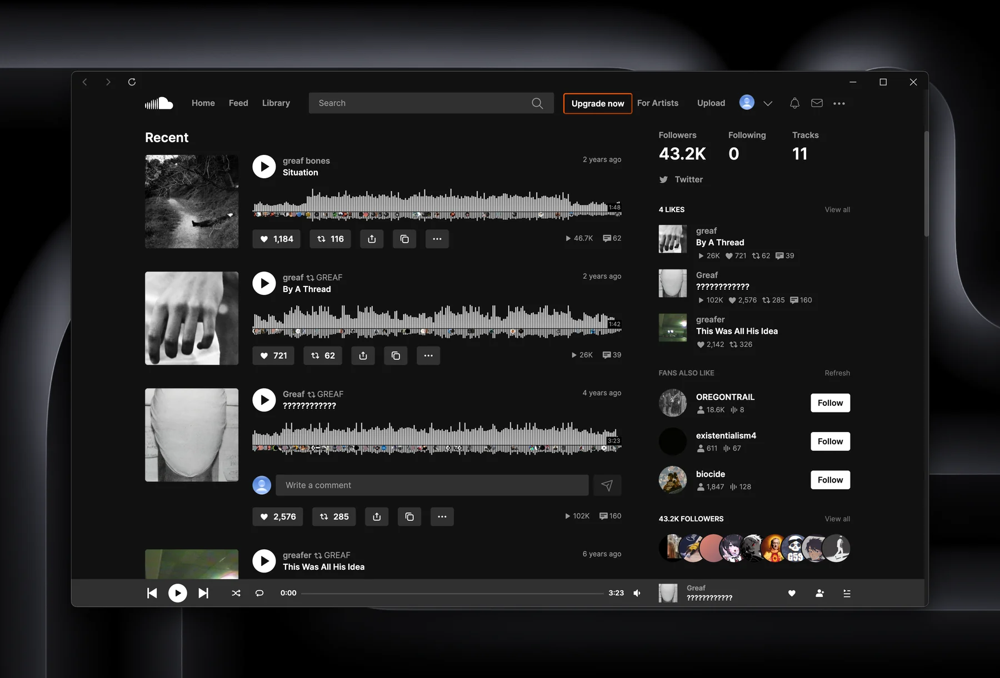
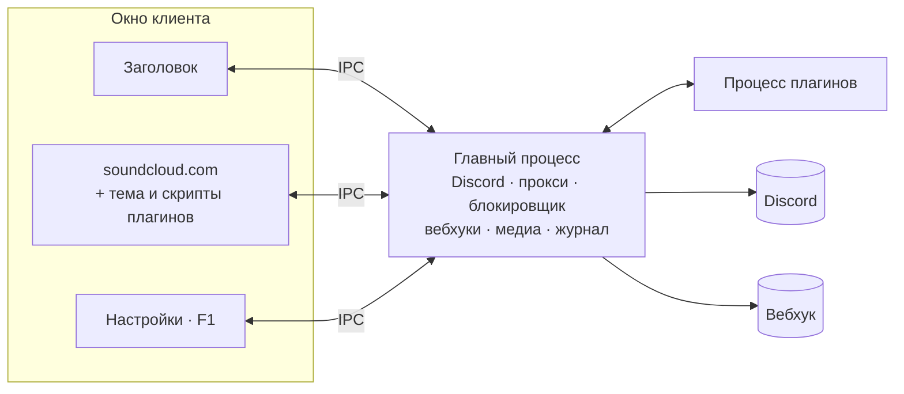

<div align="center">


<br>

[](https://github.com/zxczxczxczxczxczxc1111/soundcloud-desktop/actions/workflows/windows.yml)


[](https://github.com/zxczxczxczxczxczxc1111/soundcloud-desktop/releases/latest)

**[Возможности](#возможности)** · **[Установка](#установка)** · **[Плагины и темы](#плагины-и-темы)** · **[Сборка](#сборка-из-исходников)** · **[Диагностика](#диагностика)**

</div>

<p align="center">
  <picture>
    <source media="(prefers-color-scheme: dark)" srcset="assets/preview/soundcloud-preview-dark.webp">
    <source media="(prefers-color-scheme: light)" srcset="assets/preview/soundcloud-preview-light.webp">
    
  </picture>
</p>

## Возможности

<table>
  <tr>
    <td width="33%" valign="top">
      <br>
      <b>Discord Rich Presence</b><br>
      <sub>Друзья в Discord видят, что ты слушаешь: обложку, артиста, трек и сколько до конца. Как это выглядит, видно прямо в настройках.</sub>
    </td>
    <td width="33%" valign="top">
      <br>
      <b>Темы</b><br>
      <sub>Кидаешь CSS-файл в папку тем, и SoundCloud меняет вид. Правишь файл, и изменения сразу на экране.</sub>
    </td>
    <td width="33%" valign="top">
      <br>
      <b>Плагины</b><br>
      <sub>Добавляют то, чего в SoundCloud нет: скорость воспроизведения, шаффл по всему плейлисту. Живут в отдельном процессе.</sub>
    </td>
  </tr>
  <tr>
    <td valign="top">
      <br>
      <b>Без рекламы</b><br>
      <sub>Рекламу режет блокировщик Ghostery. Промо, «события рядом» и зазывания в Artist Pro тоже можно спрятать.</sub>
    </td>
    <td valign="top">
      <br>
      <b>Прокси</b><br>
      <sub>HTTP-прокси с логином и паролем. Пароль Windows держит в зашифрованном виде.</sub>
    </td>
    <td valign="top">
      <br>
      <b>Вебхуки</b><br>
      <sub>Трек доиграл до нужного процента, и клиент шлёт его данные в JSON на твой адрес. Пригодится для своей статистики.</sub>
    </td>
  </tr>
  <tr>
    <td valign="top">
      <br>
      <b>Управление из Windows</b><br>
      <sub>Лайк, назад, пауза и вперёд прямо в превью на панели задач. Медиаклавиши и системная панель мультимедиа тоже работают, а окно можно убрать в трей.</sub>
    </td>
    <td valign="top">
      <br>
      <b>Несколько аккаунтов</b><br>
      <sub>Основной и второй аккаунт живут рядом. Входишь в каждый один раз и дальше переключаешься в настройках.</sub>
    </td>
    <td valign="top">
      <br>
      <b>Диагностика</b><br>
      <sub>Если что-то сломалось, журнал подскажет где. Треков, адресов и паролей в нём нет.</sub>
    </td>
  </tr>
</table>

<details>
<summary><h2>Установка</h2></summary>

Бери установщик или portable на странице [последнего релиза](https://github.com/zxczxczxczxczxczxc1111/soundcloud-desktop/releases/latest). Рядом лежит `SHA256SUMS`, если захочешь сверить файлы.

| Вариант | Файл | Где профиль |
|---|---|---|
| Установщик | `soundcloud-desktop-0.2.0-setup-x64.exe` | `%APPDATA%\soundcloud-desktop` |
| Portable | `soundcloud-desktop-0.2.0-portable-x64.exe` | папка `soundcloud-desktop-data` рядом с EXE |

У клиента свой профиль, другие клиенты SoundCloud на компьютере он не трогает.

Установленный клиент обновляется сам: новую версию качает в фоне и ставит, когда ты его закрываешь. Portable сам не обновляется. Он раз в несколько часов спрашивает GitHub о новой версии и присылает уведомление, а файл ты меняешь руками. Выключить проверку можно в настройках, раздел «Обновления».

В 0.1.0 обновлений ещё не было, поэтому с неё на новую версию переходишь один раз вручную.

> [!NOTE]
> При первом запуске Windows SmartScreen может ругнуться. Сборка подписана VMP-подписью Widevine, а подписи издателя Windows у неё нет.

</details>

<details>
<summary><h2>Горячие клавиши</h2></summary>

| Клавиши | Действие |
|---|---|
| <kbd>F1</kbd> | Открыть или закрыть настройки |
| <kbd>Esc</kbd> | Закрыть настройки |
| <kbd>Ctrl</kbd> + <kbd>B</kbd> или <kbd>Ctrl</kbd> + <kbd>P</kbd> | Назад |
| <kbd>Ctrl</kbd> + <kbd>F</kbd> или <kbd>Ctrl</kbd> + <kbd>N</kbd> | Вперёд |
| <kbd>Ctrl</kbd> + <kbd>R</kbd> | Обновить страницу |
| <kbd>Ctrl</kbd> + <kbd>=</kbd> / <kbd>Ctrl</kbd> + <kbd>-</kbd> / <kbd>Ctrl</kbd> + <kbd>0</kbd> | Масштаб больше, меньше, сбросить |

</details>

<details>
<summary><h2>Плагины и темы</h2></summary>

В сборку плагины и темы не входят. Открой настройки по <kbd>F1</kbd>, нажми «Открыть папку плагинов» или «Открыть папку тем», кинь туда файл и нажми «Обновить».

> [!WARNING]
> Плагин запускает свой код на странице SoundCloud, где ты залогинен. Ставь только те, чей код прочитал сам или чьему автору доверяешь.

| Файл | Что делает | Состояние |
|---|---|---|
| [`plugins/playback-speed.js`](plugins/playback-speed.js) | Скорость от 0.50x до 2.00x, по желанию с сохранением высоты тона | покрыт тестами |
| [`plugins/shuffle-fix.js`](plugins/shuffle-fix.js) | Перемешивает весь плейлист, а не только загруженные треки | экспериментальный |
| [`plugins/cobalt-downloader.js`](plugins/cobalt-downloader.js) | Кнопка скачивания MP3 через cobalt | не работает |
| [`plugins/example-plugin.js`](plugins/example-plugin.js) | Шаблон для своего плагина | пример |
| [`themes/gruvbox.css`](themes/gruvbox.css) | Тема Gruvbox | тема |

### Свой плагин

Плагин это `.js`-файл в папке плагинов, а его ID это имя файла без расширения. Любой метод можно пропустить.

```js
/**
 * @name my-plugin
 * @author you
 * @version 1.0.0
 * @description Что делает плагин
 * @license MIT
 */

module.exports = {
    onEnable() {},
    onDisable() {},

    // track: { title, author, isPlaying, ... }
    onTrackChange(track) {},

    onThemeChange(isDark) {},

    // Строка с кодом, который выполняется на странице SoundCloud
    // при каждой загрузке и навигации.
    contentScript() {
        return `
            (function () {
                // Уборка при выключении плагина. Имя: __scrpc_cleanup_ + ID,
                // где всё кроме букв, цифр и _ заменено на _.
                window.__scrpc_cleanup_my_plugin = function () {};
            })();
        `;
    },
};
```

Хуки `onEnable`, `onDisable`, `onTrackChange` и `onThemeChange` крутятся в отдельном процессе, до окна им не дотянуться. На страницу попадает только строка из `contentScript`. Пример целиком лежит в [`plugins/example-plugin.js`](plugins/example-plugin.js).

### Своя тема

Тема это CSS поверх страницы SoundCloud. Проще всего переопределить переменные в `.theme-dark`, так устроен [`gruvbox.css`](themes/gruvbox.css).

</details>

<details>
<summary><h2>Как устроено</h2></summary>



Заголовок, страница и настройки это отдельные Electron-view, у каждого свой preload. Главный процесс слушает IPC только от своих окон. Плагины живут в `utilityProcess`, и если какой-то зависнет, клиент его прибьёт. Если упадёт страница SoundCloud, клиент её перезагрузит, а сам не закроется.

</details>

<details>
<summary><h2>Диагностика</h2></summary>

Если что-то сломалось, открой настройки по <kbd>F1</kbd> и в разделе «Диагностика» нажми «Сохранить журнал». Получится `.log`, его и прикладывай к описанию проблемы.

Журнал остаётся у тебя на компьютере. В нём версия сборки, ошибки, состояние плеера, нагрузка, уход в сон и падения процессов. Названий треков, адресов, паролей, токенов и текстов сообщений там нет. Клиент пишет показатели раз в 30 секунд в три файла по кругу, вместе они занимают до 6 МБ.

</details>

<details>
<summary><h2>Сборка из исходников</h2></summary>

Нужны Windows x64 и Node.js 24.

```powershell
npx pnpm@10.34.5 install --frozen-lockfile
npx pnpm@10.34.5 typecheck
npx pnpm@10.34.5 lint
npx pnpm@10.34.5 test
npx pnpm@10.34.5 test:electron
npx pnpm@10.34.5 build-win       # установщик
npx pnpm@10.34.5 build-win-ptb   # portable
```

Готовые файлы окажутся в папке `build`.

### Widevine и VMP-подпись

Защищённые треки играют через Castlabs Electron с Widevine. Для сборки понадобятся Python и бесплатный аккаунт [Castlabs EVS](https://github.com/castlabs/electron-releases/wiki/EVS):

```powershell
python -m pip install castlabs-evs==1.3.2
python -m castlabs_evs.account signup
```

VMP-подпись сборка получает и проверяет сама, а если подписать не вышло, останавливается. Тестовую сборку без подписи собирай с `SKIP_VMP_SIGNING=true`, так делает CI. Только защищённые треки в ней могут не заиграть.

</details>

<details>
<summary><h2>Благодарности</h2></summary>

В основе лежит [soundcloud-rpc](https://github.com/richardhbtz/soundcloud-rpc) Ричарда Хабицройтера, коммит `bc3b3de6c19175c614712e09c9af68bd1c226396`, его уведомление об авторских правах на месте.

</details>

<br>

<div align="center">
<sub>
Лицензия <a href="LICENSE">MIT</a>.<br>
Неофициальный клиент, к SoundCloud и Discord отношения не имеет. Их названия и логотипы принадлежат им.
</sub>
</div>
