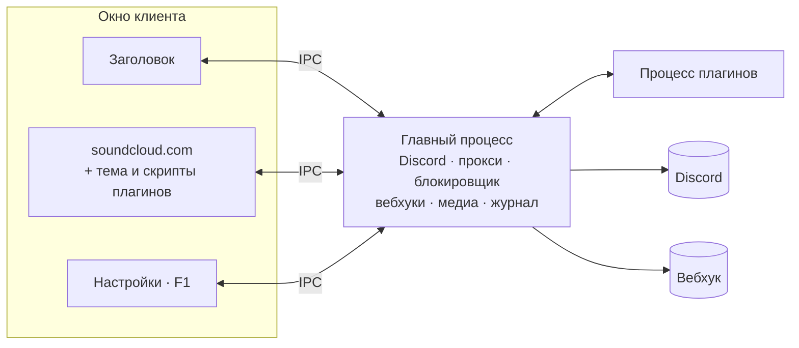

<div align="center">


<br>

[](https://github.com/zxczxczxczxczxczxc1111/soundcloud-desktop/actions/workflows/windows.yml)


[](https://github.com/zxczxczxczxczxczxc1111/soundcloud-desktop/releases/latest)

**[Возможности](#возможности)** · **[Установка](#установка)** · **[Плагины и темы](#плагины-и-темы)** · **[Сборка](#сборка-из-исходников)** · **[Диагностика](#диагностика)**

</div>

<p align="center">
  <picture>
    <source media="(prefers-color-scheme: dark)" srcset="assets/preview/soundcloud-preview-dark.webp">
    <source media="(prefers-color-scheme: light)" srcset="assets/preview/soundcloud-preview-light.webp">
    
  </picture>
</p>

## Возможности

<table>
  <tr>
    <td width="33%" valign="top">
      <br>
      <b>Discord Rich Presence</b><br>
      <sub>Обложка, исполнитель, название и таймер трека. Кнопки в активности и живой предпросмотр в настройках.</sub>
    </td>
    <td width="33%" valign="top">
      <br>
      <b>Темы</b><br>
      <sub>Свои CSS-темы из папки профиля. Изменения в файле подхватываются без перезапуска.</sub>
    </td>
    <td width="33%" valign="top">
      <br>
      <b>Плагины</b><br>
      <sub>JavaScript-плагины со своими скриптами на странице. Логика плагинов работает в отдельном процессе.</sub>
    </td>
  </tr>
  <tr>
    <td valign="top">
      <br>
      <b>Без рекламы</b><br>
      <sub>Блокировщик на движке Ghostery. Отдельно скрываются промо, «события рядом» и предложения Artist Pro.</sub>
    </td>
    <td valign="top">
      <br>
      <b>Прокси</b><br>
      <sub>HTTP-прокси с логином и паролем. Пароль хранится зашифрованным средствами Windows.</sub>
    </td>
    <td valign="top">
      <br>
      <b>Вебхуки</b><br>
      <sub>JSON с данными трека уходит на твой адрес, когда воспроизведение доходит до заданного процента.</sub>
    </td>
  </tr>
  <tr>
    <td valign="top">
      <br>
      <b>Управление из Windows</b><br>
      <sub>Кнопки в превью на панели задач: лайк, назад, пауза, вперёд. Системная панель мультимедиа и трей.</sub>
    </td>
    <td valign="top">
      <br>
      <b>Несколько аккаунтов</b><br>
      <sub>У каждого аккаунта своя сессия. Переключение в настройках.</sub>
    </td>
    <td valign="top">
      <br>
      <b>Диагностика</b><br>
      <sub>Локальный журнал ошибок и нагрузки без названий треков, адресов и паролей.</sub>
    </td>
  </tr>
</table>

<details>
<summary><h2>Установка</h2></summary>

Скачай установщик или portable со страницы [последнего релиза](https://github.com/zxczxczxczxczxczxc1111/soundcloud-desktop/releases/latest). Там же лежит `SHA256SUMS` для сверки файлов.

| Вариант | Файл | Где профиль |
|---|---|---|
| Установщик | `soundcloud-desktop-0.1.0-setup-x64.exe` | `%APPDATA%\soundcloud-desktop` |
| Portable | `soundcloud-desktop-0.1.0-portable-x64.exe` | папка `soundcloud-desktop-data` рядом с EXE |

Клиент живёт в отдельном профиле и не трогает другие установленные клиенты SoundCloud. Обновление ручное: запустить новый установщик или заменить portable-файл.

Значок GitHub в активности Discord ведёт на этот репозиторий, выключается в разделе Discord в настройках.

> [!NOTE]
> Windows SmartScreen может предупредить при первом запуске. У сборки есть VMP-подпись Widevine, но это не подпись издателя Windows.

</details>

<details>
<summary><h2>Горячие клавиши</h2></summary>

| Клавиши | Действие |
|---|---|
| <kbd>F1</kbd> | Открыть или закрыть настройки |
| <kbd>Esc</kbd> | Закрыть настройки |
| <kbd>Ctrl</kbd> + <kbd>B</kbd> или <kbd>Ctrl</kbd> + <kbd>P</kbd> | Назад |
| <kbd>Ctrl</kbd> + <kbd>F</kbd> или <kbd>Ctrl</kbd> + <kbd>N</kbd> | Вперёд |
| <kbd>Ctrl</kbd> + <kbd>R</kbd> | Обновить страницу |
| <kbd>Ctrl</kbd> + <kbd>=</kbd> / <kbd>Ctrl</kbd> + <kbd>-</kbd> / <kbd>Ctrl</kbd> + <kbd>0</kbd> | Масштаб больше, меньше, сбросить |

</details>

<details>
<summary><h2>Плагины и темы</h2></summary>

Плагины и темы не входят в сборку. Чтобы поставить, открой настройки по <kbd>F1</kbd>, нажми «Открыть папку плагинов» или «Открыть папку тем», положи туда файл и нажми «Обновить».

> [!WARNING]
> Плагин выполняет произвольный код на странице SoundCloud с твоим входом в аккаунт. Ставь только те, код которых прочитал или автору которых доверяешь.

| Файл | Что делает | Состояние |
|---|---|---|
| [`plugins/playback-speed.js`](plugins/playback-speed.js) | Скорость от 0.50x до 2.00x, по желанию с сохранением высоты тона | покрыт тестами |
| [`plugins/shuffle-fix.js`](plugins/shuffle-fix.js) | Перемешивает весь плейлист, а не только загруженные треки | экспериментальный |
| [`plugins/cobalt-downloader.js`](plugins/cobalt-downloader.js) | Кнопка скачивания MP3 через cobalt | не работает |
| [`plugins/example-plugin.js`](plugins/example-plugin.js) | Шаблон для своего плагина | пример |
| [`themes/gruvbox.css`](themes/gruvbox.css) | Тема Gruvbox | тема |

### Свой плагин

Плагин это файл `.js` в папке плагинов. Его ID это имя файла без расширения. Все методы необязательные.

```js
/**
 * @name my-plugin
 * @author you
 * @version 1.0.0
 * @description Что делает плагин
 * @license MIT
 */

module.exports = {
    onEnable() {},
    onDisable() {},

    // track: { title, author, isPlaying, ... }
    onTrackChange(track) {},

    onThemeChange(isDark) {},

    // Строка с кодом, который выполняется на странице SoundCloud
    // при каждой загрузке и навигации.
    contentScript() {
        return `
            (function () {
                // Уборка при выключении плагина. Имя: __scrpc_cleanup_ + ID,
                // где всё кроме букв, цифр и _ заменено на _.
                window.__scrpc_cleanup_my_plugin = function () {};
            })();
        `;
    },
};
```

Хуки `onEnable`, `onDisable`, `onTrackChange` и `onThemeChange` выполняются в отдельном процессе плагинов, а не в окне. `contentScript` должен вернуть строку. Полный пример: [`plugins/example-plugin.js`](plugins/example-plugin.js).

### Своя тема

Тема это CSS-файл, который накладывается на страницу SoundCloud. Удобнее всего переопределять переменные внутри `.theme-dark`, как сделано в [`gruvbox.css`](themes/gruvbox.css).

</details>

<details>
<summary><h2>Как устроено</h2></summary>



Каждая часть окна это отдельный Electron-view со своим preload. Главный процесс принимает IPC только от своих окон. Плагины работают в `utilityProcess`, зависший плагин останавливается принудительно. Если страница SoundCloud падает, клиент перезагружает её, а сам продолжает работать.

</details>

<details>
<summary><h2>Диагностика</h2></summary>

Если что-то сломалось, открой настройки по <kbd>F1</kbd> и нажми «Сохранить журнал» в разделе «Диагностика». Этот `.log` можно приложить к описанию проблемы.

Журнал никуда не отправляется. В нём версия сборки, ошибки, состояние воспроизведения, нагрузка, события сна и сбои процессов. Названия треков, адреса, пароли, токены и тексты сообщений туда не пишутся. Показатели снимаются раз в 30 секунд, три сменяемых файла занимают до 6 МБ.

</details>

<details>
<summary><h2>Сборка из исходников</h2></summary>

Нужны Windows x64 и Node.js 24.

```powershell
npx pnpm@10.34.5 install --frozen-lockfile
npx pnpm@10.34.5 typecheck
npx pnpm@10.34.5 lint
npx pnpm@10.34.5 test
npx pnpm@10.34.5 test:electron
npx pnpm@10.34.5 build-win       # установщик
npx pnpm@10.34.5 build-win-ptb   # portable
```

Готовые файлы появляются в папке `build`.

### Widevine и VMP-подпись

Для защищённого воспроизведения используется Castlabs Electron с Widevine. Перед сборкой нужны Python и бесплатный аккаунт [Castlabs EVS](https://github.com/castlabs/electron-releases/wiki/EVS):

```powershell
python -m pip install castlabs-evs==1.3.2
python -m castlabs_evs.account signup
```

Сборка сама получает и проверяет VMP-подпись. Если подпись не удалась, сборка останавливается. Для тестовой сборки без подписи задай `SKIP_VMP_SIGNING=true`, так работает CI. Защищённые треки в такой сборке могут не играть.

</details>

<details>
<summary><h2>Благодарности</h2></summary>

Клиент основан на [soundcloud-rpc](https://github.com/richardhbtz/soundcloud-rpc) Ричарда Хабицройтера, коммит `bc3b3de6c19175c614712e09c9af68bd1c226396`. Исходное уведомление об авторских правах сохранено. Плагин скорости портирован из [SoundCloud-Desktop](https://github.com/zxcloli666/SoundCloud-Desktop), shuffle-fix написан [iamnotbobby](https://gist.github.com/iamnotbobby/604828ac84d9d1ec54eabb8d99d56c7b).

</details>

<br>

<div align="center">
<sub>
Распространяется по лицензии <a href="LICENSE">MIT</a>.<br>
Неофициальный клиент. Проект не связан с SoundCloud и Discord, их названия и логотипы принадлежат владельцам.
</sub>
</div>
